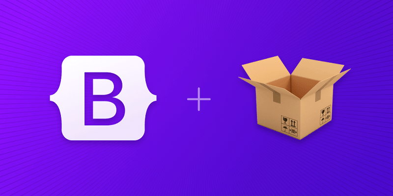
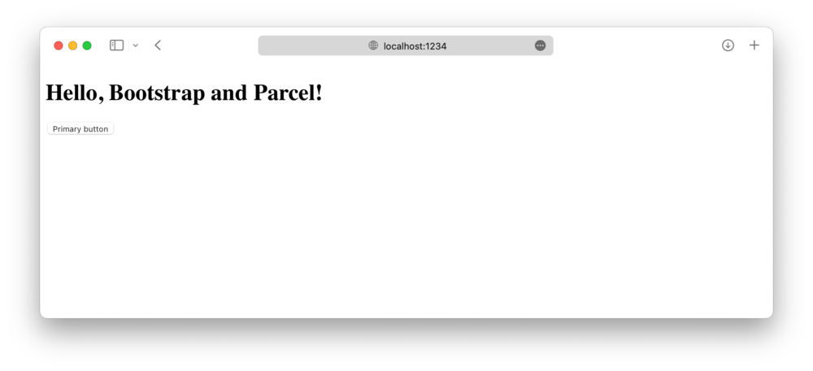
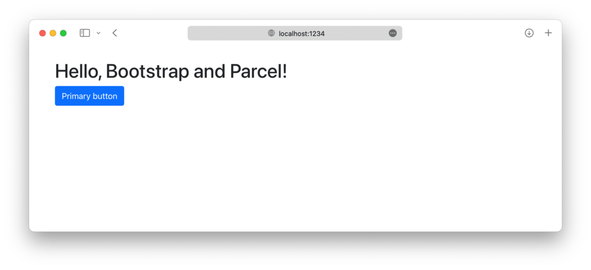

# Bootstrap e Parcel

O guia oficial sobre como incluir e agrupar CSS e JavaScript do Bootstrap em
seu projeto usando Parcel.
{: .lead }



**Quer pular para o final?**
Baixe o código-fonte e a demonstração funcional para este guia do repositório
[twbs/examples](https://github.com/twbs/examples/tree/main/parcel).
Você também pode
[abrir o exemplo no StackBlitz](https://stackblitz.com/github/twbs/examples/tree/main/parcel?file=index.html),
mas não executá-lo porque o Parcel não é suportado lá no momento.
{: .callout .info }

## Configuração

Estamos construindo um projeto Parcel com Bootstrap do zero, então há alguns
pré-requisitos e etapas iniciais antes de realmente começarmos.
Este guia requer que você tenha o Node.js instalado e alguma familiaridade com o
terminal.

1. **Crie uma pasta de projeto e configure o npm.**
   Criaremos a pasta `meu-projeto` e inicializaremos o npm com o argumento `-y`
   para evitar que ele nos faça todas as perguntas interativas.

```shell
mkdir meu-projeto && cd meu-projeto
npm init -y
```

2. **Instale o Parcel.**
   Diferentemente do nosso guia do Webpack, há apenas uma dependência de
   ferramenta de construção aqui.
   O Parcel instalará automaticamente transformadores de linguagem (como Sass)
   conforme os detecta.
   Usamos `--save-dev` para sinalizar que essa dependência é somente para uso em
   desenvolvimento e não para produção.

```shell
npm i --save-dev parcel
```

3. **Instale o Bootstrap.**
   Agora podemos instalar o Bootstrap.
   Também instalaremos o Popper, já que nossos menus suspensos, _popovers_ e
   _tooltips_ dependem dele para seu posicionamento.
   Se você não planeja usar esses componentes, pode omitir o Popper aqui.

```shell
npm i --save bootstrap @popperjs/core
```

Agora que temos todas as dependências necessárias instaladas, podemos começar a
trabalhar na criação dos arquivos do projeto e na importação do Bootstrap.

## Estrutura do projeto

Já criamos a pasta `meu-projeto` e inicializamos o npm.
Agora também criaremos nossa pasta `src` e os arquivos de folha de estilo e
JavaScript para completar a estrutura do projeto.
Execute o seguinte a partir de `meu-projeto` ou crie manualmente a pasta e a
estrutura de arquivos mostradas abaixo.

```shell
mkdir {src,src/js,src/scss}
touch src/index.html src/js/main.js src/scss/styles.scss
```

Quando terminar, seu projeto completo deverá ficar assim:

```text
meu-projeto/
├── src/
│   ├── js/
│   │   └── main.js
│   ├── scss/
│   │   └── styles.scss
│   └── index.html
├── package-lock.json
└── package.json
```

Neste ponto, tudo está no lugar certo, mas o Parcel precisa de uma página HTML e
script npm para iniciar nosso servidor.

## Configure o Parcel

Com as dependências instaladas e nossa pasta de projeto pronta para começarmos a
codificar, agora podemos configurar o Parcel e executar nosso projeto
localmente.
O Parcel em si não requer nenhum arquivo de configuração por _design_, mas
precisamos de um _script_ npm e um arquivo HTML para iniciar nosso servidor.

1. **Preencha o arquivo `src/index.html`.**
   O Parcel precisa de uma página para renderizar, então usamos nossa página
   `index.html` para configurar um HTML básico, incluindo nossos arquivos CSS e
   JavaScript.

```html
<!doctype html>
<html lang="pt-br">
 <head>
   <meta charset="utf-8">
   <meta name="viewport" content="width=device-width, initial-scale=1">
   <title>Bootstrap com Parcel</title>
   <link rel="stylesheet" href="scss/styles.scss">
   <script type="module" src="js/main.js"></script>
 </head>
 <body>
   <div class="container py-4 px-3 mx-auto">
     <h1>Olá, Bootstrap e Parcel!</h1>
     <button class="btn btn-primary">Botão primário</button>
   </div>
 </body>
</html>
```

   Estamos incluindo um pouco de estilo Bootstrap aqui com
   `div class="container"` e `<button>` para que possamos ver quando o CSS do
   Bootstrap for carregado pelo Parcel.

   O Parcel detectará automaticamente que estamos usando Sass e instalará o
   [_plugin_ Sass Parcel](https://parceljs.org/languages/sass/) para dar suporte
   a ele.
   No entanto, se desejar, você também pode executar manualmente
   `npm i --save-dev @parcel/transformer-sass`.

2. **Adicione os scripts npm do Parcel.**
   Abra o `package.json` e adicione o seguinte _script_ `start` ao objeto
   `scripts`.
   Usaremos esse _script_ para iniciar nosso servidor de desenvolvimento Parcel
   e renderizar o arquivo HTML que criamos após ele ser compilado no diretório
   `dist`.

```json
{
  // ...
  "scripts": {
    "start": "parcel serve src/index.html --public-url / --dist-dir dist",
    "test": "echo \"Erro: nenhum teste especificado\" && exit 1"
  },
  // ...
}
```

3. **E finalmente, podemos iniciar o Parcel.**
   Da pasta `meu-projeto` no seu terminal, execute o _script_ npm
   recém-adicionado:

```shell
npm start
```

   

No próximo e último passo deste guia, importaremos todo o CSS e JavaScript do
Bootstrap.

## Importe o Bootstrap

Importar o Bootstrap para o Parcel requer duas importações, uma para o nosso
`styles.scss` e uma para o nosso `main.js`.

1. **Importe o CSS do Bootstrap.**
   Adicione o seguinte ao `src/scss/styles.scss` para importar todos os arquivos
   fonte Sass do Bootstrap.

```scss
// Importa todo o CSS do Bootstrap
@import "bootstrap/scss/bootstrap";
```

   *Você também pode importar nossas folhas de estilo individualmente se
   quiser.
   [Leia nossa documentação de importação do Sass](../customize/sass.md#importing)
   para detalhes.*

2. **Importe o JS do Bootstrap.**
   Adicione o seguinte ao `src/js/main.js` para importar todo o JS do Bootstrap.
   O Popper será importado automaticamente pelo Bootstrap.

<!-- eslint-skip -->
```javascript
// Importa todo o JS do Bootstrap
import * as bootstrap from 'bootstrap'
```

   Você também pode importar _plugins_ JavaScript individualmente, conforme
   necessário, para manter os pacotes pequenos:

<!-- eslint-skip -->
```javascript
import Alert from 'bootstrap/js/dist/alert'

// ou especifique quais plugins você precisa:
import { Tooltip, Toast, Popover } from 'bootstrap'
```

   *[Leia nossa documentação do JavaScript](../comecando/javascript.md) para
   obter mais informações sobre como usar os plugins do Bootstrap.*

3. **E pronto! 🎉**
   Com os arquivos fonte Sass e JS do Bootstrap totalmente carregados, seu
   servidor de desenvolvimento local deve ficar assim:

   

   Agora você pode começar a adicionar quaisquer componentes do Bootstrap que
   quiser usar.
   Não deixe de
   [conferir o projeto de exemplo completo do Parcel](https://github.com/twbs/examples/tree/main/parcel)
   para saber como incluir Sass personalizado adicional e otimizar sua
   compilação importando apenas as partes do CSS e JS do Bootstrap que você
   precisa.


