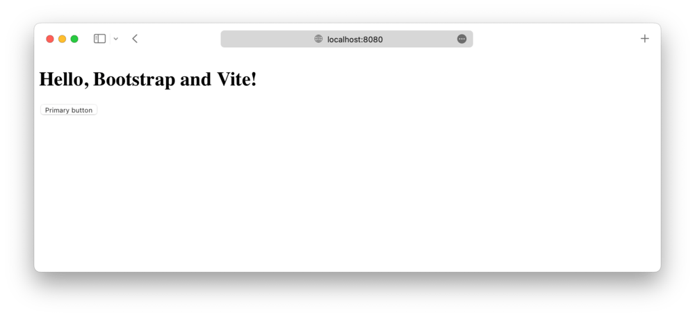
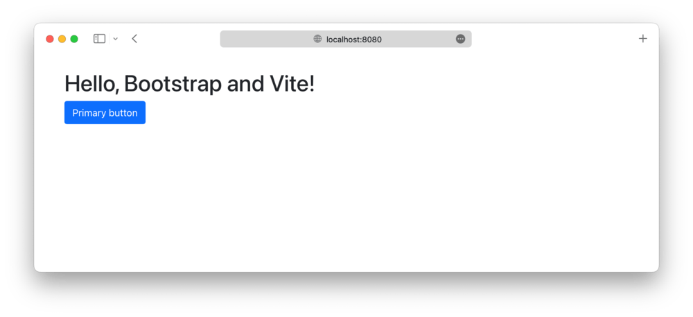

# Bootstrap e Vite

O guia oficial sobre como incluir e agrupar CSS e JavaScript do Bootstrap em seu
projeto usando Vite.
{: .lead }


**Quer pular para o final?**
Baixe o código-fonte e a demonstração funcional para este guia do repositório
[twbs/examples](https://github.com/twbs/examples/tree/main/vite).
Você também pode
[abrir o exemplo no StackBlitz](https://stackblitz.com/github/twbs/examples/tree/main/vite?file=index.html)
para edição ao vivo.
{: .callout .info }

## Configuração

Estamos construindo um projeto Vite com Bootstrap do zero, então há alguns
pré-requisitos e passos iniciais antes de realmente começarmos.
Este guia requer que você tenha o Node.js instalado e alguma familiaridade com o
terminal.

1. **Crie uma pasta de projeto e configure o npm.**
   Criaremos a pasta `meu-projeto` e inicializaremos o npm com o argumento `-y`
   para evitar que ele nos faça todas as perguntas interativas.

```shell
mkdir meu-projeto && cd meu-projeto
npm init -y
```

2. **Instale o Vite.**
   Diferentemente do nosso guia do Webpack, há apenas uma dependência de
   ferramenta de construção aqui.
   Usamos `--save-dev` para sinalizar que essa dependência é somente para uso em
   desenvolvimento e não para produção.

```shell
npm i --save-dev vite
```

3. **Instale o Bootstrap.**
   Agora podemos instalar o Bootstrap.
   Também instalaremos o Popper, já que nossos menus suspensos, _popovers_ e
   _tooltips_ dependem dele para seu posicionamento.
   Se você não planeja usar esses componentes, pode omitir o Popper aqui.

```shell
npm i --save bootstrap @popperjs/core
```

4. **Instale a dependência adicional.**
   Além do Vite e do Bootstrap, precisamos de outra dependência (Sass) para
   importar e empacotar adequadamente o CSS do Bootstrap.

```shell
npm i --save-dev sass
```

Agora que temos todas as dependências necessárias instaladas e configuradas,
podemos começar a trabalhar na criação dos arquivos do projeto e na importação
do Bootstrap.

## Estrutura do projeto

Já criamos a pasta `meu-projeto` e inicializamos o npm.
Agora também criaremos nossa pasta `src` e os arquivos da folha de estilo e do
JavaScript para completar a estrutura do projeto.
Execute o seguinte a partir de `meu-projeto` ou crie manualmente a pasta e a
estrutura de arquivos mostradas abaixo.

```shell
mkdir {src,src/js,src/scss}
touch src/index.html src/js/main.js src/scss/styles.scss vite.config.js
```

Quando terminar, seu projeto completo deverá ficar assim:

```text
meu-projeto/
├── src/
│   ├── js/
│   │   └── main.js
│   └── scss/
│   |   └── styles.scss
|   └── index.html
├── package-lock.json
├── package.json
└── vite.config.js
```

Neste ponto, tudo está no lugar certo, mas o Vite não funciona porque ainda não
preenchemos nosso `vite.config.js`.

## Configure o Vite

Com as dependências instaladas e nossa pasta de projeto pronta para começarmos a
codificar, agora podemos configurar o Vite e executar nosso projeto localmente.

1. **Abra o `vite.config.js` no seu editor.**
   Como ele está em branco, precisaremos adicionar alguma configuração inicial a
   ele para que possamos iniciar nosso servidor.
   Esta parte da configuração informa ao Vite onde procurar o JavaScript do
   nosso projeto e como o servidor de desenvolvimento deve se comportar
   (atualizando a partir da pasta `src` com recarregamento automático).

<!-- eslint-skip -->
```javascript
import { resolve } from 'path'

export default {
 root: resolve(__dirname, 'src'),
 build: {
   outDir: '../dist'
 },
 server: {
   port: 8080
 }
}
```

2. **Em seguida, preenchemos `src/index.html`.**
   Esta é a página HTML que o Vite carregará no navegador para utilizar o CSS e
   o JS agrupados que adicionaremos a ele em passos posteriores.

```html
<!doctype html>
<html lang="pt-br">
 <head>
   <meta charset="utf-8">
   <meta name="viewport" content="width=device-width, initial-scale=1">
   <title>Bootstrap com Vite</title>
   <script type="module" src="./js/main.js"></script>
 </head>
 <body>
   <div class="container py-4 px-3 mx-auto">
     <h1>Olá, Bootstrap e Vite!</h1>
     <button class="btn btn-primary">Botão primário</button>
   </div>
 </body>
</html>
```

   Estamos incluindo um pouco do estilo Bootstrap aqui com
   `div class="container"` e `<button>` para que possamos ver quando o CSS do
   Bootstrap for carregado pelo Vite.

3. **Agora precisamos de um _script_ npm para executar o Vite.**
   Abra o `package.json` e adicione o _script_ `start` mostrado abaixo (você já
   deve ter o _script_ `test`).
   Usaremos esse _script_ para iniciar nosso servidor de desenvolvimento Vite
   local.

```json
{
 // ...
 "scripts": {
   "start": "vite",
   "test": "echo \"Erro: nenhum teste especificado\" && exit 1"
 },
 // ...
}
```

4. **E finalmente, podemos iniciar o Vite.**
   Da pasta `meu-projeto` no seu terminal, execute o _script_ npm
   recém-adicionado:

```shell
npm start
```

   

Na próxima e última seção deste guia, importaremos todo o CSS e JavaScript do
Bootstrap.

## Importe o Bootstrap

1. **Importe o CSS do Bootstrap.**
   Adicione o seguinte ao `src/scss/styles.scss` para importar todos os arquivos
   fonte Sass do Bootstrap.

```scss
// Importa todo o CSS do Bootstrap
@import "bootstrap/scss/bootstrap";
```

   _Você também pode importar nossas folhas de estilo individualmente, se
   quiser.
   [Leia nossa documentação de importação do Sass](../customize/sass.md#importing)
   para obter detalhes._

2. **Em seguida, carregamos o CSS e importamos o JavaScript do Bootstrap.**
   Adicione o seguinte ao `src/js/main.js` para carregar o CSS e importar todo o
   JS do Bootstrap.
   O Popper será importado automaticamente pelo Bootstrap.

<!-- eslint-skip -->
```javascript
// Importa nosso CSS personalizado
import '../scss/styles.scss'

// Importa todo o JS do Bootstrap
import * as bootstrap from 'bootstrap'
```

   Você também pode importar _plugins_ JavaScript individualmente, conforme
   necessário, para manter os pacotes pequenos:

<!-- eslint-skip -->
```javascript
import Alert from 'bootstrap/js/dist/alert';

// ou especifique quais plugins você precisa:
import { Tooltip, Toast, Popover } from 'bootstrap';
```

   _[Leia nossa documentação do JavaScript](../comecando/javascript.md) para
   mais informações sobre como usar os plugins do Bootstrap._

3. **E pronto! 🎉**
   Com os arquivos fonte Sass e JS do Bootstrap totalmente carregados, seu
   servidor de desenvolvimento local deve ficar assim:

   

   Agora você pode começar a adicionar quaisquer componentes do Bootstrap que
   quiser usar.
   Não deixe de
   [conferir o projeto de exemplo completo do Vite](https://github.com/twbs/examples/tree/main/vite)
   para saber como incluir Sass personalizado adicional e otimizar sua
   construção importando apenas as partes do CSS e JS do Bootstrap que você
   precisa.


