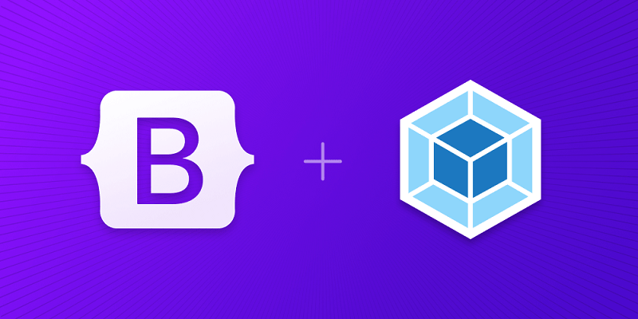
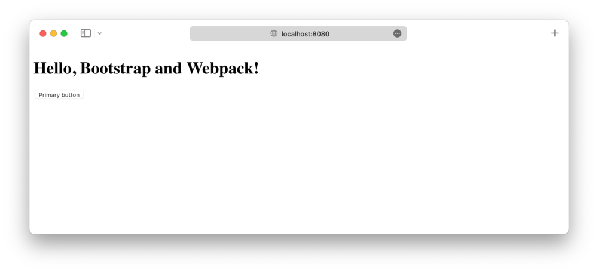
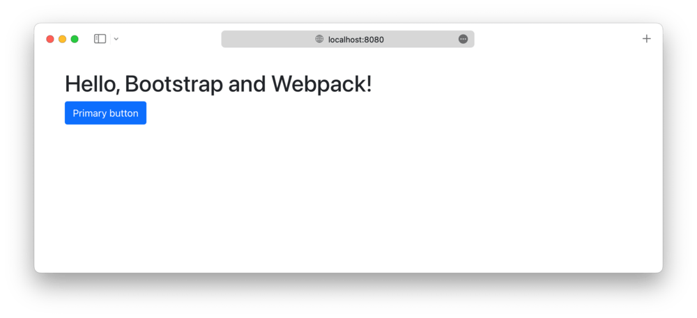

# Bootstrap e Webpack

O guia oficial sobre como incluir e empacotar CSS e JavaScript do Bootstrap em
seu projeto usando Webpack.
{: .lead }



**Quer pular para o final?**
Baixe o código-fonte e a demonstração funcional para este guia do repositório
[twbs/examples repository](https://github.com/twbs/examples/tree/main/webpack).
Você também pode
[abrir o exemplo no StackBlitz](https://stackblitz.com/github/twbs/examples/tree/main/webpack?file=index.html)
para edição ao vivo.
{: .callout .info }

## Configuração

Estamos construindo um projeto Webpack com Bootstrap do zero, então há alguns
pré-requisitos e etapas iniciais antes de realmente começarmos.
Este guia requer que você tenha o Node.js instalado e alguma familiaridade com o
terminal.

1. **Crie uma pasta de projeto e configure o npm.**
   Criaremos a pasta `meu-projeto` e inicializaremos o npm com o argumento `-y`
   para evitar que ele nos faça todas as perguntas interativas.

```shell
mkdir meu-projeto && cd meu-projeto
npm init -y
```

2. **Instale o Webpack.**
   Em seguida, precisamos instalar nossas dependências de desenvolvimento do
   Webpack: `webpack` para o núcleo do Webpack, `webpack-cli` para que possamos
   executar comandos Webpack a partir do terminal e `webpack-dev-server` para
   que possamos executar um servidor de desenvolvimento local.
   Além disso, instalaremos `html-webpack-plugin` para poder armazenar nosso
   `index.html` no diretório `src` em vez do `dist` padrão.
   Usamos `--save-dev` para sinalizar que essas dependências são apenas para uso
   em desenvolvimento e não para produção.

```shell
npm i --save-dev webpack webpack-cli webpack-dev-server html-webpack-plugin
```

3. **Instale o Bootstrap.**
   Agora podemos instalar o Bootstrap.
   Também instalaremos o Popper, já que nossos menus suspensos, _popovers_ e
   _tooltips_ dependem dele para seu posicionamento.
   Se você não planeja usar esses componentes, pode omitir o Popper aqui.

```shell
npm i --save bootstrap @popperjs/core
```

4. **Instale as dependências adicionais.**
   Além do Webpack e do Bootstrap, precisamos de mais algumas dependências para
   importar e empacotar adequadamente o CSS e o JS do Bootstrap com o Webpack.
   Elas incluem o Sass, alguns carregadores e o Autoprefixer.

```shell
npm i --save-dev autoprefixer css-loader postcss-loader sass sass-loader style-loader
```

Agora que temos todas as dependências necessárias instaladas, podemos começar a
trabalhar criando os arquivos do projeto e importando o Bootstrap.

## Estrutura do projeto

Já criamos a pasta `meu-projeto` e inicializamos o npm.
Agora também criaremos nossas pastas `src` e `dist` para completar a estrutura
do projeto.
Execute o seguinte a partir do `meu-projeto` ou crie manualmente a pasta e a
estrutura de arquivos mostradas abaixo:

```shell
mkdir {src,src/js,src/scss}
touch src/index.html src/js/main.js src/scss/styles.scss webpack.config.js
```

Quando terminar, seu projeto completo deverá ficar assim:

```text
meu-projeto/
├── src/
│   ├── js/
│   │   └── main.js
│   ├── scss/
│   │   └── styles.scss
│   └── index.html
├── package-lock.json
├── package.json
└── webpack.config.js
```

Neste ponto, tudo está no lugar certo, mas o Webpack não funcionará porque ainda
não preenchemos nosso `webpack.config.js`.

## Configure o Webpack

Com as dependências instaladas e nossa pasta de projeto pronta para começarmos a
codificar, agora podemos configurar o Webpack e executar nosso projeto
localmente.

1. **Abra o arquivo `webpack.config.js` em seu editor.**
   Como está em branco, precisaremos adicionar alguma configuração inicial a ele
   para que possamos iniciar nosso servidor.
   Esta parte da configuração informa ao Webpack onde procurar o JavaScript do
   nosso projeto, para onde enviar o código compilado (`dist`) e como o servidor
   de desenvolvimento deve se comportar (copiando da pasta `dist` com _hot
   reload_):

```js
'use strict'

const path = require('path')
const HtmlWebpackPlugin = require('html-webpack-plugin')

module.exports = {
  mode: 'development',
  entry: './src/js/main.js',
  output: {
    filename: 'main.js',
    path: path.resolve(__dirname, 'dist')
  },
  devServer: {
    static: path.resolve(__dirname, 'dist'),
    port: 8080,
    hot: true
  },
  plugins: [
    new HtmlWebpackPlugin({ template: './src/index.html' })
  ]
}
```

2. **Em seguida, preenchemos nosso `src/index.html`.**
   Esta é a página HTML que o Webpack carregará no navegador para utilizar o CSS
   e o JS empacotados que adicionaremos a ele em etapas posteriores.
   Antes de fazermos isso, temos que dar a ele algo para renderizar e incluir o
   JS listado em `output` da etapa anterior:

```html
<!doctype html>
<html lang="pt-br">
<head>
  <meta charset="utf-8">
  <meta name="viewport" content="width=device-width, initial-scale=1">
  <title>Bootstrap com Webpack</title>
</head>
<body>
  <div class="container py-4 px-3 mx-auto">
    <h1>Olá, Bootstrap e Webpack!</h1>
    <button class="btn btn-primary">Botão primário</button>
  </div>
</body>
</html>
```

   Estamos incluindo um pouco de estilo Bootstrap aqui com
   `div class="container"` e `<button>` para que possamos ver quando o CSS do
   Bootstrap for carregado pelo Webpack.

3. **Agora precisamos de um _script_ npm para executar o Webpack.**
   Abra `package.json` e adicione o _script_ `start` mostrado abaixo (você já
   deve ter o _script_ `test`).
   Usaremos esse _script_ para iniciar nosso servidor de desenvolvimento Webpack
   local.
   Você também pode adicionar um _script_ `build` mostrado abaixo para construir
   seu projeto:

```json
{
  // ...
  "scripts": {
    "start": "webpack serve",
    "build": "webpack build --mode=production",
    "test": "echo \"Erro: nenhum teste especificado\" && exit 1"
  },
  // ...
}
```

4. **E finalmente, podemos iniciar o Webpack.**
   Na pasta `meu-projeto` no seu terminal, execute o _script_ npm
   recém-adicionado:

```shell
npm start
```

   
   {: .img-fluid }

Na próxima e última seção deste guia, configuraremos os carregadores do Webpack
e importaremos todo o CSS e JavaScript do Bootstrap.

## Importe o Bootstrap

Importar Bootstrap para o Webpack requer os carregadores que instalamos na
primeira seção.
Nós os instalamos com o npm, mas agora o Webpack precisa ser configurado para
usá-los.

1. **Configure os carregadores em `webpack.config.js`.**
   Seu arquivo de configuração agora está completo e deve corresponder ao
   trecho abaixo.
   A única parte nova aqui é a seção `module`.

```js
'use strict'

const path = require('path')
const autoprefixer = require('autoprefixer')
const HtmlWebpackPlugin = require('html-webpack-plugin')

module.exports = {
  mode: 'development',
  entry: './src/js/main.js',
  output: {
    filename: 'main.js',
    path: path.resolve(__dirname, 'dist')
  },
  devServer: {
    static: path.resolve(__dirname, 'dist'),
    port: 8080,
    hot: true
  },
  plugins: [
    new HtmlWebpackPlugin({ template: './src/index.html' })
  ],
  module: {
    rules: [
      {
        test: /\.(scss)$/,
        use: [
          {
            // Adiciona CSS ao DOM injetando uma tag `<style>`.
            loader: 'style-loader'
          },
          {
            // Interpreta `@import` e `url()` como `import/require()` e os resolverá.
            loader: 'css-loader'
          },
          {
            // Carregador para o webpack processar CSS com PostCSS.
            loader: 'postcss-loader',
            options: {
              postcssOptions: {
                plugins: [
                  autoprefixer
                ]
              }
            }
          },
          {
            // Carrega um arquivo SASS/SCSS e o compila para CSS.
            loader: 'sass-loader'
          }
        ]
      }
    ]
  }
}
```

   Aqui está uma recapitulação do porquê precisamos de todos esses carregadores.
   `style-loader` injeta o CSS em um elemento `<style>` no `<head>` da página
   HTML, `css-loader` ajuda a usar `@import` e `url()`, `postcss-loader` é
   necessário para o Autoprefixer, e `sass-loader` nos permite usar Sass.

2. **Agora, vamos importar o CSS do Bootstrap.**
   Adicione o seguinte ao arquivo `src/scss/styles.scss` para importar todo o
   Sass do Bootstrap.

```scss
// Importa todo o CSS do Bootstrap
@import "bootstrap/scss/bootstrap";
```

   _Você também pode importar nossas folhas de estilo individualmente, se
   quiser.
   [Leia nossa documentação de importação do Sass](../customize/sass.md#importing)
   para obter detalhes._

3. **Em seguida, carregamos o CSS e importamos o JavaScript do Bootstrap.**
   Adicione o seguinte ao `src/js/main.js` para carregar o CSS e importar todo o
   JS do Bootstrap.
   O Popper será importado automaticamente pelo Bootstrap.

```js
// Importa nosso CSS personalizado
import '../scss/styles.scss'

// Importa todo o JS do Bootstrap
import * as bootstrap from 'bootstrap'
```

   Você também pode importar _plugins_ JavaScript individualmente, conforme
   necessário, para manter o tamanho dos pacotes reduzido:

```js
import Alert from 'bootstrap/js/dist/alert'

// ou especifique quais plugins você precisa:
import { Tooltip, Toast, Popover } from 'bootstrap'
```

   _[Leia nossa documentação JavaScript](../comecando/javascript.md) para mais
   informações sobre como usar os plugins do Bootstrap._

4. **E pronto! 🎉**
   Com o Sass e o JS do Bootstrap totalmente carregados, seu servidor de
   desenvolvimento local deve ficar assim:

   
   {: .img-fluid }

   Agora você pode começar a adicionar quaisquer componentes do Bootstrap que
   desejar usar.
   Não deixe de
   [conferir o projeto de exemplo completo do Webpack](https://github.com/twbs/examples/tree/main/webpack)
   para saber como incluir Sass personalizado adicional e otimizar sua
   compilação importando apenas as partes do CSS e JS do Bootstrap que você
   precisa.

## Otimizações de produção

Dependendo da sua configuração, você pode querer implementar algumas otimizações
adicionais de segurança e velocidade úteis para executar o projeto em produção.
Observe que essas otimizações não são aplicadas no
[projeto de exemplo do Webpack](https://github.com/twbs/examples/tree/main/webpack)
e cabe a você implementar.

### Extraindo CSS

O `style-loader` que configuramos acima emite convenientemente CSS no pacote
para que não seja necessário carregar manualmente um arquivo CSS em
`dist/index.html`.
Essa abordagem pode não funcionar com uma Política de Segurança de Conteúdo
rigorosa, no entanto, e pode se tornar um gargalo em sua aplicação devido ao
grande tamanho do pacote.

Para separar o CSS para que possamos carregá-lo diretamente de
`dist/index.html`, use o _plugin_ `mini-css-extract-loader` do Webpack.

Primeiro, instale o _plugin_:

```shell
npm install --save-dev mini-css-extract-plugin
```

Em seguida, instancie e use o _plugin_ na configuração do Webpack:

```diff
--- a/webpack.config.js
+++ b/webpack.config.js
@@ -3,6 +3,7 @@
 const path = require('path')
 const autoprefixer = require('autoprefixer')
 const HtmlWebpackPlugin = require('html-webpack-plugin')
+const miniCssExtractPlugin = require('mini-css-extract-plugin')

 module.exports = {
   mode: 'development',
@@ -17,7 +18,8 @@ module.exports = {
     hot: true
   },
   plugins: [
-    new HtmlWebpackPlugin({ template: './src/index.html' })
+    new HtmlWebpackPlugin({ template: './src/index.html' }),
+    new miniCssExtractPlugin()
   ],
   module: {
     rules: [
@@ -25,8 +27,8 @@ module.exports = {
         test: /\.(scss)$/,
         use: [
           {
-            // Adiciona CSS ao DOM injetando uma tag `<style>`
-            loader: 'style-loader'
+            // Extrai CSS para cada arquivo JS que inclui CSS
+            loader: miniCssExtractPlugin.loader
           },
           {
```

Após executar `npm run build` novamente, haverá um novo arquivo `dist/main.css`,
que conterá todo o CSS importado por `src/js/main.js`.
Se você visualizar `dist/index.html` no seu navegador agora, o estilo estará
faltando, pois agora está em `dist/main.css`.
Você pode incluir o CSS gerado em `dist/index.html` assim:

```diff
--- a/dist/index.html
+++ b/dist/index.html
@@ -3,6 +3,7 @@
   <head>
     <meta charset="utf-8">
     <meta name="viewport" content="width=device-width, initial-scale=1">
+    <link rel="stylesheet" href="./main.css">
     <title>Bootstrap com Webpack</title>
   </head>
   <body>
```

### Extraindo arquivos SVG

O CSS do Bootstrap inclui várias referências a arquivos SVG por meio de URIs
`data:` em linha.
Se você definir uma Política de Segurança de Conteúdo para seu projeto que
bloqueie URIs `data:` para imagens, esses arquivos SVG não serão carregados.
Você pode contornar esse problema extraindo os arquivos SVG em linha usando o
recurso de módulos de ativos do Webpack.

Configure o Webpack para extrair arquivos SVG em linha dessa forma:

```diff
--- a/webpack.config.js
+++ b/webpack.config.js
@@ -23,6 +23,14 @@ module.exports = {
   },
   module: {
     rules: [
+      {
+        mimetype: 'image/svg+xml',
+        scheme: 'data',
+        type: 'asset/resource',
+        generator: {
+          filename: 'icons/[hash].svg'
+        }
+      },
       {
         test: /\.(scss)$/,
         use: [
```

Depois de executar `npm run build` novamente, você encontrará os arquivos SVG
extraídos em `dist/icons` e referenciados corretamente do CSS.


