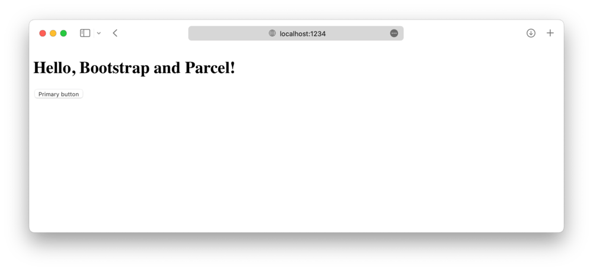

} }/assets/img/guides/bootstrap-parcel.png, /docs/{ { < param docs_version >} }/assets/img/guides/bootstrap-parcel@2x.png 2x" src="/docs/{ { < param docs_version >} }/assets/img/guides/bootstrap-parcel.png" width="800" height="400" alt="">

{ { < callout >} }
**Want to skip to the end?** Download the source code and working demo for this
guide from
the [twbs/examples repository](https://github.com/twbs/examples/tree/main/parcel).
You can
also [open the example in StackBlitz](https://stackblitz.com/github/twbs/examples/tree/main/parcel?file=index.html)
but not run it because Parcel isn't currently supported there.
{ { < /callout >} }

## Setup

We're building a Parcel project with Bootstrap from scratch, so there are some
prerequisites and upfront steps before we can really get started. This guide
requires you to have Node.js installed and some familiarity with the terminal.

1. **Create a project folder and set up npm.** We'll create the `my-project`
   folder and initialize npm with the `-y` argument to avoid it asking us all
   the interactive questions.

   ```shell
   mkdir my-project && cd my-project
   npm init -y
   ```

2. **Install Parcel.** Unlike our Webpack guide, there's only a single build
   tool dependency here. Parcel will automatically install language
   transformers (like Sass) as it detects them. We use `--save-dev` to signal
   that this dependency is only for development use and not for production.

   ```shell
   npm i --save-dev parcel
   ```

3. **Install Bootstrap.** Now we can install Bootstrap. We'll also install
   Popper since our dropdowns, popovers, and tooltips depend on it for their
   positioning. If you don't plan on using those components, you can omit Popper
   here.

   ```shell
   npm i --save bootstrap @popperjs/core
   ```

Now that we have all the necessary dependencies installed, we can get to work
creating the project files and importing Bootstrap.

## Project structure

We've already created the `my-project` folder and initialized npm. Now we'll
also create our `src` folder, stylesheet, and JavaScript file to round out the
project structure. Run the following from `my-project`, or manually create the
folder and file structure shown below.

```shell
mkdir {src,src/js,src/scss}
touch src/index.html src/js/main.js src/scss/styles.scss
```

When you're done, your complete project should look like this:

```text
my-project/
├── src/
│   ├── js/
│   │   └── main.js
│   ├── scss/
│   │   └── styles.scss
│   └── index.html
├── package-lock.json
└── package.json
```

At this point, everything is in the right place, but Parcel needs an HTML page
and npm script to start our server.

## Configure Parcel

With dependencies installed and our project folder ready for us to start coding,
we can now configure Parcel and run our project locally. Parcel itself requires
no configuration file by design, but we do need an npm script and an HTML file
to start our server.

1. **Fill in the `src/index.html` file.** Parcel needs a page to render, so we
   use our `index.html` page to set up some basic HTML, including our CSS and
   JavaScript files.

   ```html
   <!doctype html>
   <html lang="pt-br">
     <head>
       <meta charset="utf-8">
       <meta name="viewport" content="width=device-width, initial-scale=1">
       <title>Bootstrap w/ Parcel</title>
       <link rel="stylesheet" href="scss/styles.scss">
       <script type="module" src="js/main.js"></script>
     </head>
     <body>
       <div class="container py-4 px-3 mx-auto">
         <h1>Hello, Bootstrap and Parcel!</h1>
         <button class="btn btn-primary">Primary button</button>
       </div>
     </body>
   </html>
   ```

   We're including a little bit of Bootstrap styling here with the
   `div class="container"` and `<button>` so that we see when Bootstrap's CSS is
   loaded by Parcel.

   Parcel will automatically detect we're using Sass and install
   the [Sass Parcel plugin](https://parceljs.org/languages/sass/) to support it.
   However, if you wish, you can also manually run
   `npm i --save-dev @parcel/transformer-sass`.

2. **Add the Parcel npm scripts.** Open the `package.json` and add the following
   `start` script to the `scripts` object. We'll use this script to start our
   Parcel development server and render the HTML file we created after it's
   compiled into the `dist` directory.

   ```javascripton
   {
      // ...
      "scripts": {
        "start": "parcel serve src/index.html --public-url / --dist-dir dist",
        "test": "echo \"Error: no test specified\" && exit 1"
      },
      // ...
   }
   ```

3. **And finally, we can start Parcel.** From the `my-project` folder in your
   terminal, run that newly added npm script:

   ```shell
   npm start
   ```

   

In the next and final section to this guide, we'll import all of Bootstrap's CSS
and JavaScript.

## Import Bootstrap

Importing Bootstrap into Parcel requires two imports, one into our `styles.scss`
and one into our `main.js`.

1. **Import Bootstrap's CSS.** Add the following to `src/scss/styles.scss` to
   import all of Bootstrap's source Sass.

   ```scss
   // Import all of Bootstrap's CSS
   @import "bootstrap/scss/bootstrap";
   ```

   *You can also import our stylesheets individually if you
   want. [Read our Sass import docs](   /customize/sass.md#importing) for details.*

2. **Import Bootstrap's JS.** Add the following to `src/js/main.js` to import
   all of Bootstrap's JS. Popper will be imported automatically through
   Bootstrap.

   <!-- eslint-skip -->
   ```javascript
   // Import all of Bootstrap's JS
   import * as bootstrap from 'bootstrap'
   ```

   You can also import JavaScript plugins individually as needed to keep bundle
   sizes down:

   <!-- eslint-skip -->
   ```javascript
   import Alert from 'bootstrap/js/dist/alert'

   // or, specify which plugins you need:
   import { Tooltip, Toast, Popover } from 'bootstrap'
   ```

   *[Read our JavaScript docs](../comecando/javascript.md)
   for more information on how to use Bootstrap's plugins.*

3. **And you're done! 🎉** With Bootstrap's source Sass and JS fully loaded, your
   local development server should now look like this:

   

   Now you can start adding any Bootstrap components you want to use. Be sure
   to [check out the complete Parcel example project](https://github.com/twbs/examples/tree/main/parcel)
   for how to include additional custom Sass and optimize your build by
   importing only the parts of Bootstrap's CSS and JS that you need.

{ { < markdown >} }
{ { < partial "guide-footer.md" >} }
{ { < /markdown >} }
